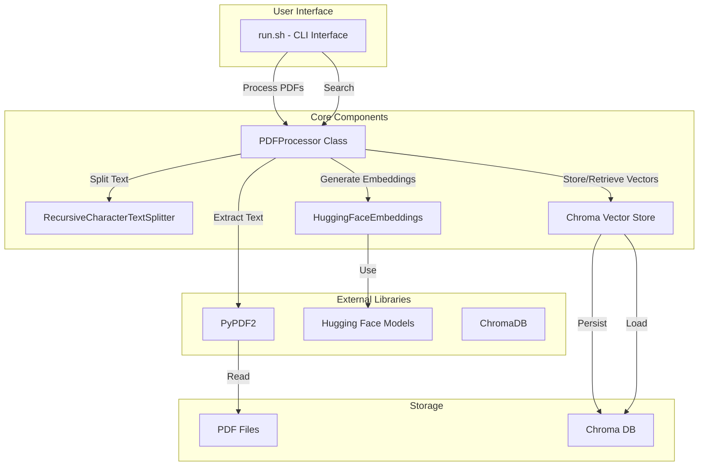

# PDF to Embeddings Architecture

This document describes the architecture of the PDF to Embeddings system.

## System Overview

The PDF to Embeddings system is designed to process PDF documents, extract their text content, convert the text into vector embeddings, and enable semantic search capabilities. The system uses Hugging Face's sentence transformers for generating embeddings and Chroma for vector storage and retrieval.

## Architecture Diagram

## Component Details

### User Interface
- **run.sh**: A Bash script that provides a command-line interface for users to process PDFs and perform searches.

### Core Components
- **PDFProcessor**: The main class that orchestrates the entire process from PDF text extraction to vector search.
  - **Methods**:
    - `__init__`: Initializes the processor with directories and components
    - `extract_text_from_pdf`: Extracts text from a single PDF file
    - `process_pdfs`: Processes all PDFs in the directory
    - `create_vector_store`: Creates and persists the vector store
    - `search`: Searches the vector store for similar content

- **RecursiveCharacterTextSplitter**: Splits text into chunks for better processing and embedding.
  - Configuration: chunk_size=1000, chunk_overlap=200

- **HuggingFaceEmbeddings**: Generates vector embeddings from text using Hugging Face models.
  - Model: "sentence-transformers/all-MiniLM-L6-v2"

- **Chroma Vector Store**: Stores and retrieves vector embeddings for similarity search.

### External Libraries
- **PyPDF2**: Used for reading and extracting text from PDF files.
- **Hugging Face Models**: Provides pre-trained models for text embeddings.
- **ChromaDB**: Vector database for storing and querying embeddings.

### Storage
- **PDF Files**: Source PDF documents stored in the "pdfs" directory.
- **Chroma DB**: Persistent storage for vector embeddings in the "chroma_db" directory.

## Data Flow

1. **PDF Processing Flow**:
   - User selects "Process PDFs" option in the CLI
   - PDFProcessor scans the PDF directory
   - For each PDF file:
     - Extract text using PyPDF2
     - Split text into chunks using TextSplitter
   - Generate embeddings for all text chunks using HuggingFaceEmbeddings
   - Store embeddings in Chroma vector store
   - Persist the vector store to disk

2. **Search Flow**:
   - User selects "Search" option and enters a query
   - PDFProcessor loads the vector store from disk
   - Query is converted to an embedding using the same model
   - Vector store performs similarity search
   - Results are returned and displayed to the user

## Dependencies

- Python 3.x
- PyPDF2
- langchain
- langchain_huggingface
- langchain_community
- sentence-transformers
- chromadb
- dotenv
