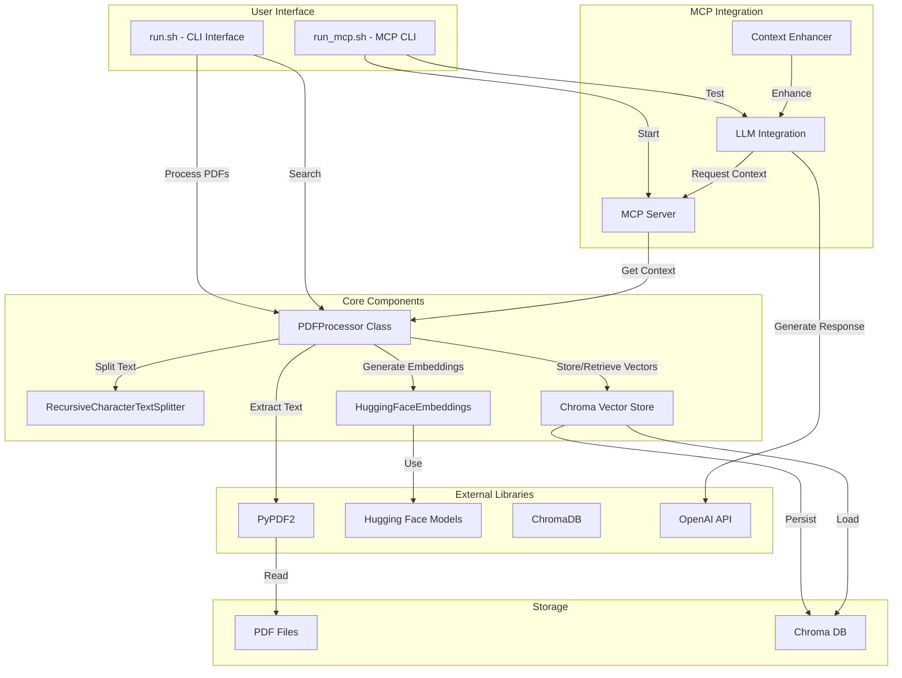

# PDF to Embeddings Architecture

This document describes the architecture of the PDF to Embeddings system.

## System Overview

The PDF to Embeddings system is designed to process PDF documents, extract their text content, convert the text into vector embeddings, and enable semantic search capabilities. The system uses Hugging Face's sentence transformers for generating embeddings and Chroma for vector storage and retrieval.

The system also includes a Model Context Protocol (MCP) integration that allows connecting the vector search capabilities to Large Language Models (LLMs) for enhanced, context-aware responses.

## Architecture Diagram

```mermaid
graph TD
    subgraph "User Interface"
        UI[run.sh - CLI Interface]
        MCPUI[run_mcp.sh - MCP CLI]
    end

    subgraph "Core Components"
        PDFProcessor[PDFProcessor Class]
        TextSplitter[RecursiveCharacterTextSplitter]
        Embeddings[HuggingFaceEmbeddings]
        VectorStore[Chroma Vector Store]
    end

    subgraph "MCP Integration"
        MCPServer[MCP Server]
        LLMIntegration[LLM Integration]
        ContextEnhancer[Context Enhancer]
    end

    subgraph "External Libraries"
        PyPDF2[PyPDF2]
        HuggingFace[Hugging Face Models]
        ChromaDB[ChromaDB]
        OpenAI[OpenAI API]
    end

    subgraph "Storage"
        PDFs[PDF Files]
        DB[Chroma DB]
    end

    UI -->|Process PDFs| PDFProcessor
    UI -->|Search| PDFProcessor

    MCPUI -->|Start| MCPServer
    MCPUI -->|Test| LLMIntegration

    MCPServer -->|Get Context| PDFProcessor
    LLMIntegration -->|Request Context| MCPServer
    LLMIntegration -->|Generate Response| OpenAI

    PDFProcessor -->|Extract Text| PyPDF2
    PDFProcessor -->|Split Text| TextSplitter
    PDFProcessor -->|Generate Embeddings| Embeddings
    PDFProcessor -->|Store/Retrieve Vectors| VectorStore

    PyPDF2 -->|Read| PDFs
    Embeddings -->|Use| HuggingFace
    VectorStore -->|Persist| DB
    VectorStore -->|Load| DB

    ContextEnhancer -->|Enhance| LLMIntegration
```

## Component Details

### User Interface
- **run.sh**: A Bash script that provides a command-line interface for users to process PDFs and perform searches.
- **run_mcp.sh**: A Bash script that starts the MCP server and provides a testing interface for the MCP integration.

### Core Components
- **PDFProcessor**: The main class that orchestrates the entire process from PDF text extraction to vector search.
  - **Methods**:
    - `__init__`: Initializes the processor with directories and components
    - `extract_text_from_pdf`: Extracts text from a single PDF file
    - `process_pdfs`: Processes all PDFs in the directory
    - `create_vector_store`: Creates and persists the vector store
    - `search`: Searches the vector store for similar content

- **RecursiveCharacterTextSplitter**: Splits text into chunks for better processing and embedding.
  - Configuration: chunk_size=1000, chunk_overlap=200

- **HuggingFaceEmbeddings**: Generates vector embeddings from text using Hugging Face models.
  - Model: "sentence-transformers/all-MiniLM-L6-v2"

- **Chroma Vector Store**: Stores and retrieves vector embeddings for similarity search.

### MCP Integration Components
- **MCP Server**: A FastAPI server that implements the Model Context Protocol, exposing the vector search system to LLMs.
  - Provides context from the vector store based on LLM queries
  - Implements the standard MCP API endpoints
  - Connects to the PDFProcessor for retrieving relevant document contexts

- **LLM Integration**: Client code that demonstrates how to use the MCP server with LLMs.
  - Sends queries to the MCP server to get relevant context
  - Formats context into prompts for the LLM
  - Communicates with OpenAI API to generate enhanced responses

- **Context Enhancer**: Utilities for enhancing the context provided to LLMs.
  - Formats document chunks for optimal LLM consumption
  - Adds metadata and relevance information to context

### External Libraries
- **PyPDF2**: Used for reading and extracting text from PDF files.
- **Hugging Face Models**: Provides pre-trained models for text embeddings.
- **ChromaDB**: Vector database for storing and querying embeddings.
- **OpenAI API**: Provides access to large language models for generating enhanced responses.
- **FastAPI**: Web framework for building the MCP server API.

### Storage
- **PDF Files**: Source PDF documents stored in the "pdfs" directory.
- **Chroma DB**: Persistent storage for vector embeddings in the "chroma_db" directory.

## Data Flow

1. **PDF Processing Flow**:
   - User selects "Process PDFs" option in the CLI
   - PDFProcessor scans the PDF directory
   - For each PDF file:
     - Extract text using PyPDF2
     - Split text into chunks using TextSplitter
   - Generate embeddings for all text chunks using HuggingFaceEmbeddings
   - Store embeddings in Chroma vector store
   - Persist the vector store to disk

2. **Search Flow**:
   - User selects "Search" option and enters a query
   - PDFProcessor loads the vector store from disk
   - Query is converted to an embedding using the same model
   - Vector store performs similarity search
   - Results are returned and displayed to the user

3. **MCP Integration Flow**:
   - User starts the MCP server using run_mcp.sh
   - MCP server initializes and connects to the PDFProcessor
   - User sends a query to the LLM integration
   - LLM integration requests context from the MCP server
   - MCP server retrieves relevant document chunks using PDFProcessor
   - MCP server returns formatted context to the LLM integration
   - LLM integration creates an enhanced prompt with the context
   - LLM integration sends the prompt to the OpenAI API
   - OpenAI API returns a response grounded in the document context
   - Response is displayed to the user

## Dependencies

### Core Dependencies
- Python 3.x
- PyPDF2
- langchain
- langchain_huggingface
- langchain_community
- sentence-transformers
- chromadb
- dotenv

### MCP Integration Dependencies
- fastapi
- uvicorn
- pydantic
- requests
- openai
- python-dotenv
