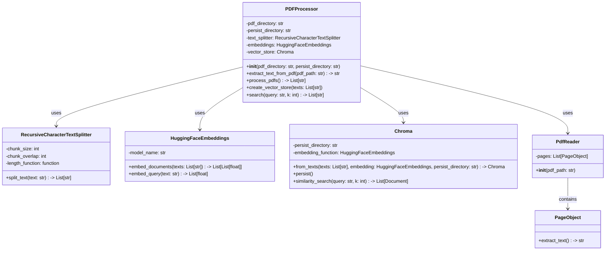
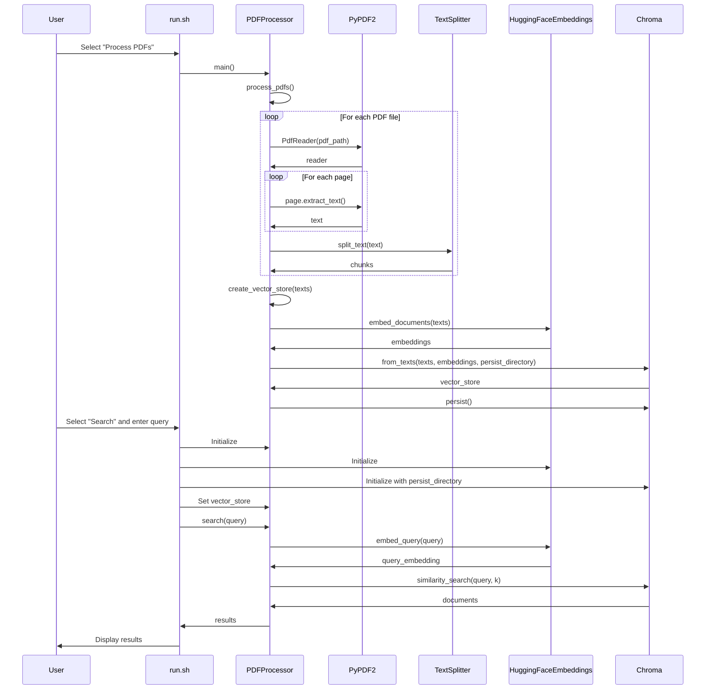

# PDF to Embeddings Class Diagram

This document provides a detailed class diagram and function call flow for the PDF to Embeddings system.

## Class Diagram

## Function Call Flow

## Function Details

### PDFProcessor Class

#### `__init__(pdf_directory: str, persist_directory: str = "chroma_db")`
- **Purpose**: Initialize the PDFProcessor with directories and components
- **Parameters**:
  - `pdf_directory`: Directory containing PDF files
  - `persist_directory`: Directory for storing vector database
- **Actions**:
  - Sets up the text splitter with chunk_size=1000, chunk_overlap=200
  - Initializes HuggingFaceEmbeddings with model "sentence-transformers/all-MiniLM-L6-v2"
  - Sets vector_store to None initially

#### `extract_text_from_pdf(pdf_path: str) -> str`
- **Purpose**: Extract text from a single PDF file
- **Parameters**:
  - `pdf_path`: Path to the PDF file
- **Returns**: Extracted text as a string
- **Actions**:
  - Creates a PdfReader for the file
  - Iterates through pages and extracts text
  - Concatenates all page texts

#### `process_pdfs() -> List[str]`
- **Purpose**: Process all PDFs in the directory
- **Returns**: List of text chunks
- **Actions**:
  - Scans the PDF directory for PDF files
  - For each PDF, extracts text and splits into chunks
  - Collects all chunks into a list

#### `create_vector_store(texts: List[str])`
- **Purpose**: Create and persist the vector store
- **Parameters**:
  - `texts`: List of text chunks to embed
- **Actions**:
  - Creates a Chroma vector store from texts
  - Persists the vector store to disk

#### `search(query: str, k: int = 3) -> List[str]`
- **Purpose**: Search the vector store for similar content
- **Parameters**:
  - `query`: Search query
  - `k`: Number of results to return
- **Returns**: List of text chunks matching the query
- **Actions**:
  - Checks if vector_store is initialized
  - Performs similarity search
  - Extracts and returns page content from results
