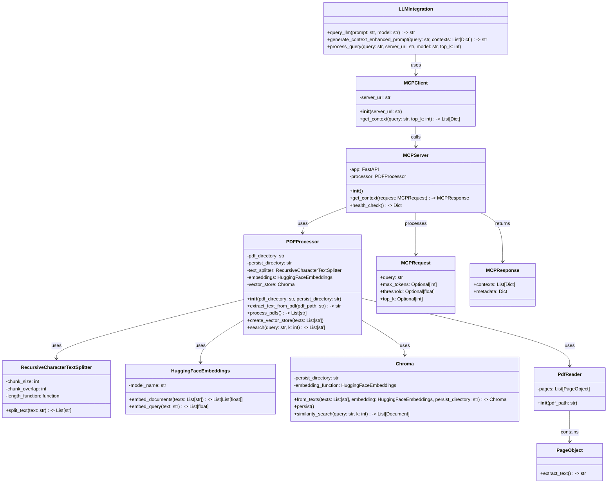
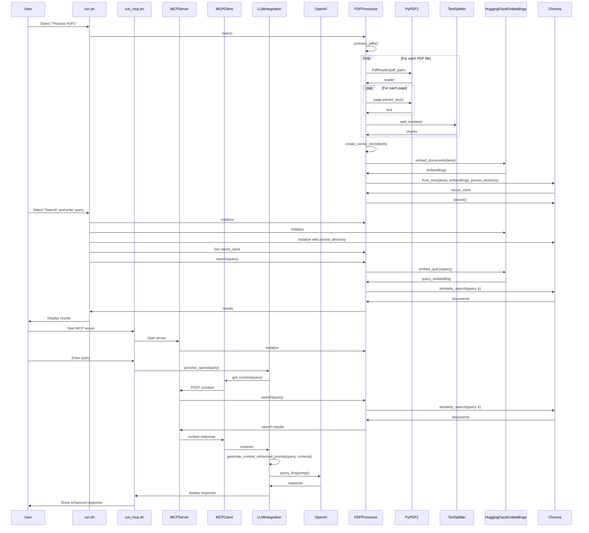

# PDF to Embeddings Class Diagram

This document provides a detailed class diagram and function call flow for the PDF to Embeddings system.

## Class Diagram

```mermaid
classDiagram
    %% Core Classes
    class PDFProcessor {
        -pdf_directory: str
        -persist_directory: str
        -text_splitter: RecursiveCharacterTextSplitter
        -embeddings: HuggingFaceEmbeddings
        -vector_store: Chroma
        +__init__(pdf_directory: str, persist_directory: str)
        +extract_text_from_pdf(pdf_path: str) -> str
        +process_pdfs() -> List[str]
        +create_vector_store(texts: List[str])
        +search(query: str, k: int) -> List[str]
    }

    class RecursiveCharacterTextSplitter {
        -chunk_size: int
        -chunk_overlap: int
        -length_function: function
        +split_text(text: str) -> List[str]
    }

    class HuggingFaceEmbeddings {
        -model_name: str
        +embed_documents(texts: List[str]) -> List[List[float]]
        +embed_query(text: str) -> List[float]
    }

    class Chroma {
        -persist_directory: str
        -embedding_function: HuggingFaceEmbeddings
        +from_texts(texts: List[str], embedding: HuggingFaceEmbeddings, persist_directory: str) -> Chroma
        +persist()
        +similarity_search(query: str, k: int) -> List[Document]
    }

    class PdfReader {
        -pages: List[PageObject]
        +__init__(pdf_path: str)
    }

    class PageObject {
        +extract_text() -> str
    }

    %% MCP Classes
    class MCPServer {
        -app: FastAPI
        -processor: PDFProcessor
        +__init__()
        +get_context(request: MCPRequest) -> MCPResponse
        +health_check() -> Dict
    }

    class MCPRequest {
        +query: str
        +max_tokens: Optional[int]
        +threshold: Optional[float]
        +top_k: Optional[int]
    }

    class MCPResponse {
        +contexts: List[Dict]
        +metadata: Dict
    }

    class MCPClient {
        -server_url: str
        +__init__(server_url: str)
        +get_context(query: str, top_k: int) -> List[Dict]
    }

    class LLMIntegration {
        +query_llm(prompt: str, model: str) -> str
        +generate_context_enhanced_prompt(query: str, contexts: List[Dict]) -> str
        +process_query(query: str, server_url: str, model: str, top_k: int)
    }

    %% Relationships
    PDFProcessor --> RecursiveCharacterTextSplitter : uses
    PDFProcessor --> HuggingFaceEmbeddings : uses
    PDFProcessor --> Chroma : uses
    PDFProcessor --> PdfReader : uses
    PdfReader --> PageObject : contains

    MCPServer --> PDFProcessor : uses
    MCPServer --> MCPRequest : processes
    MCPServer --> MCPResponse : returns
    MCPClient --> MCPServer : calls
    LLMIntegration --> MCPClient : uses
```

## Function Call Flow

```mermaid
sequenceDiagram
    participant User
    participant run.sh
    participant run_mcp.sh
    participant MCPServer
    participant MCPClient
    participant LLMIntegration
    participant OpenAI
    participant PDFProcessor
    participant PyPDF2
    participant TextSplitter
    participant HuggingFaceEmbeddings
    participant Chroma

    %% PDF Processing Flow
    User->>run.sh: Select "Process PDFs"
    run.sh->>PDFProcessor: main()
    PDFProcessor->>PDFProcessor: process_pdfs()
    loop For each PDF file
        PDFProcessor->>PyPDF2: PdfReader(pdf_path)
        PyPDF2->>PDFProcessor: reader
        loop For each page
            PDFProcessor->>PyPDF2: page.extract_text()
            PyPDF2->>PDFProcessor: text
        end
        PDFProcessor->>TextSplitter: split_text(text)
        TextSplitter->>PDFProcessor: chunks
    end
    PDFProcessor->>PDFProcessor: create_vector_store(texts)
    PDFProcessor->>HuggingFaceEmbeddings: embed_documents(texts)
    HuggingFaceEmbeddings->>PDFProcessor: embeddings
    PDFProcessor->>Chroma: from_texts(texts, embeddings, persist_directory)
    Chroma->>PDFProcessor: vector_store
    PDFProcessor->>Chroma: persist()

    %% Search Flow
    User->>run.sh: Select "Search" and enter query
    run.sh->>PDFProcessor: Initialize
    run.sh->>HuggingFaceEmbeddings: Initialize
    run.sh->>Chroma: Initialize with persist_directory
    run.sh->>PDFProcessor: Set vector_store
    run.sh->>PDFProcessor: search(query)
    PDFProcessor->>HuggingFaceEmbeddings: embed_query(query)
    HuggingFaceEmbeddings->>PDFProcessor: query_embedding
    PDFProcessor->>Chroma: similarity_search(query, k)
    Chroma->>PDFProcessor: documents
    PDFProcessor->>run.sh: results
    run.sh->>User: Display results

    %% MCP Integration Flow
    User->>run_mcp.sh: Start MCP server
    run_mcp.sh->>MCPServer: Start server
    MCPServer->>PDFProcessor: Initialize

    User->>run_mcp.sh: Enter query
    run_mcp.sh->>LLMIntegration: process_query(query)
    LLMIntegration->>MCPClient: get_context(query)
    MCPClient->>MCPServer: POST /context
    MCPServer->>PDFProcessor: search(query)
    PDFProcessor->>Chroma: similarity_search(query, k)
    Chroma->>PDFProcessor: documents
    PDFProcessor->>MCPServer: search results
    MCPServer->>MCPClient: context response
    MCPClient->>LLMIntegration: contexts
    LLMIntegration->>LLMIntegration: generate_context_enhanced_prompt(query, contexts)
    LLMIntegration->>OpenAI: query_llm(prompt)
    OpenAI->>LLMIntegration: response
    LLMIntegration->>run_mcp.sh: display response
    run_mcp.sh->>User: Show enhanced response
```

## Function Details

### PDFProcessor Class

#### `__init__(pdf_directory: str, persist_directory: str = "chroma_db")`
- **Purpose**: Initialize the PDFProcessor with directories and components
- **Parameters**:
  - `pdf_directory`: Directory containing PDF files
  - `persist_directory`: Directory for storing vector database
- **Actions**:
  - Sets up the text splitter with chunk_size=1000, chunk_overlap=200
  - Initializes HuggingFaceEmbeddings with model "sentence-transformers/all-MiniLM-L6-v2"
  - Sets vector_store to None initially

#### `extract_text_from_pdf(pdf_path: str) -> str`
- **Purpose**: Extract text from a single PDF file
- **Parameters**:
  - `pdf_path`: Path to the PDF file
- **Returns**: Extracted text as a string
- **Actions**:
  - Creates a PdfReader for the file
  - Iterates through pages and extracts text
  - Concatenates all page texts

#### `process_pdfs() -> List[str]`
- **Purpose**: Process all PDFs in the directory
- **Returns**: List of text chunks
- **Actions**:
  - Scans the PDF directory for PDF files
  - For each PDF, extracts text and splits into chunks
  - Collects all chunks into a list

#### `create_vector_store(texts: List[str])`
- **Purpose**: Create and persist the vector store
- **Parameters**:
  - `texts`: List of text chunks to embed
- **Actions**:
  - Creates a Chroma vector store from texts
  - Persists the vector store to disk

#### `search(query: str, k: int = 3) -> List[str]`
- **Purpose**: Search the vector store for similar content
- **Parameters**:
  - `query`: Search query
  - `k`: Number of results to return
- **Returns**: List of text chunks matching the query
- **Actions**:
  - Checks if vector_store is initialized
  - Performs similarity search
  - Extracts and returns page content from results

### MCP Server Class

#### `__init__()`
- **Purpose**: Initialize the MCP server
- **Actions**:
  - Creates a FastAPI application
  - Initializes the PDFProcessor with the correct paths
  - Sets up API endpoints

#### `get_context(request: MCPRequest) -> MCPResponse`
- **Purpose**: Provide context from vector search for an LLM query
- **Parameters**:
  - `request`: MCPRequest object containing the query and parameters
- **Returns**: MCPResponse object with contexts and metadata
- **Actions**:
  - Extracts query and parameters from the request
  - Uses PDFProcessor to search for relevant contexts
  - Formats results according to MCP specification
  - Returns formatted response

#### `health_check() -> Dict`
- **Purpose**: Check the health of the MCP server
- **Returns**: Dictionary with health status
- **Actions**:
  - Checks if the vector store is initialized
  - Returns appropriate status

### MCPClient Class

#### `__init__(server_url: str)`
- **Purpose**: Initialize the MCP client
- **Parameters**:
  - `server_url`: URL of the MCP server
- **Actions**:
  - Stores the server URL
  - Sets up the context endpoint URL

#### `get_context(query: str, top_k: int = 5) -> List[Dict]`
- **Purpose**: Get context from the MCP server for a query
- **Parameters**:
  - `query`: The query to get context for
  - `top_k`: Number of context items to retrieve
- **Returns**: List of context items
- **Actions**:
  - Sends a POST request to the MCP server
  - Processes the response
  - Returns the contexts

### LLMIntegration Class

#### `query_llm(prompt: str, model: str = "gpt-3.5-turbo") -> str`
- **Purpose**: Query an LLM with a prompt
- **Parameters**:
  - `prompt`: The prompt to send to the LLM
  - `model`: The model to use
- **Returns**: The LLM's response
- **Actions**:
  - Sends a request to the OpenAI API
  - Returns the generated text

#### `generate_context_enhanced_prompt(query: str, contexts: List[Dict]) -> str`
- **Purpose**: Generate a prompt enhanced with context for the LLM
- **Parameters**:
  - `query`: The user's query
  - `contexts`: Context items from the MCP server
- **Returns**: A prompt with context for the LLM
- **Actions**:
  - Formats the query and contexts into a structured prompt
  - Adds instructions for the LLM

#### `process_query(query: str, server_url: str, model: str, top_k: int)`
- **Purpose**: Process a query using the MCP server and LLM
- **Parameters**:
  - `query`: The query to process
  - `server_url`: URL of the MCP server
  - `model`: LLM model to use
  - `top_k`: Number of context items to retrieve
- **Actions**:
  - Gets context from MCP server
  - Generates enhanced prompt with context
  - Queries the LLM
  - Displays the response
