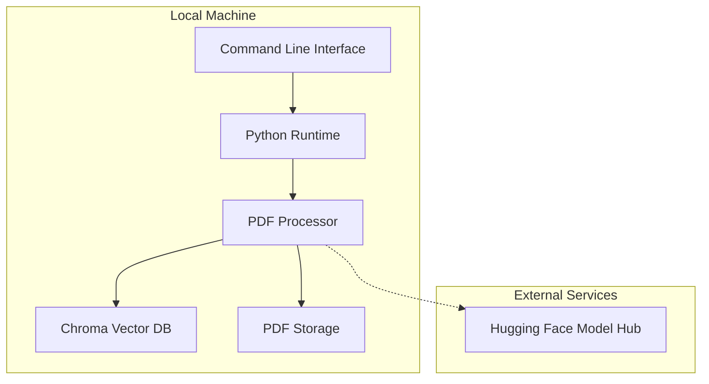
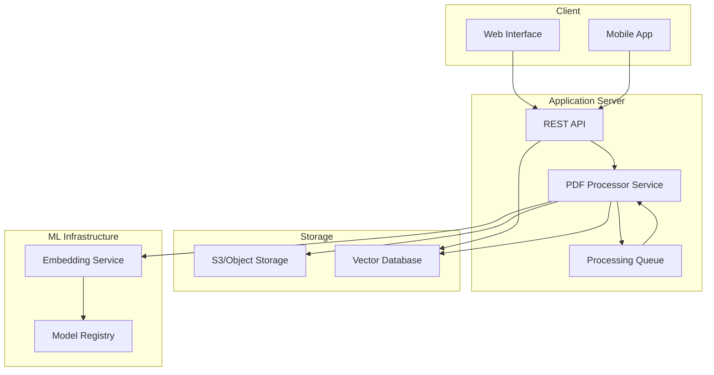
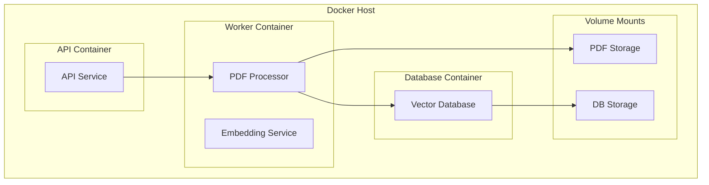
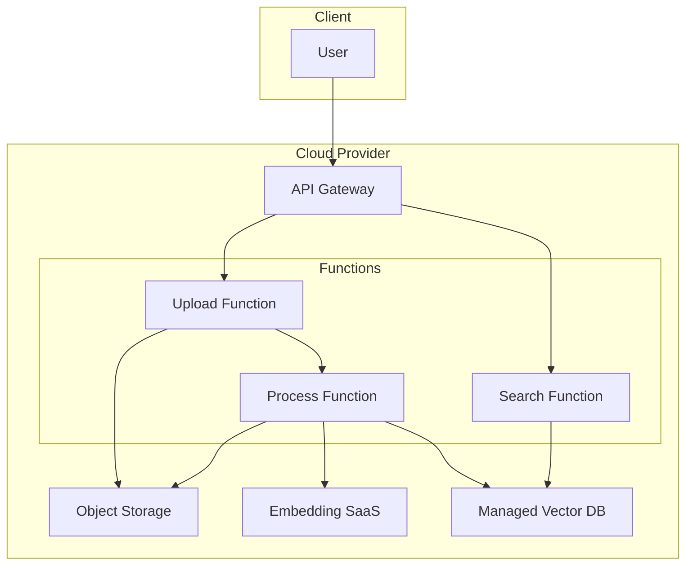

# PDF to Embeddings Deployment Diagram

This document describes potential deployment scenarios for the PDF to Embeddings system.

## Local Deployment

## Potential Cloud Deployment

## Scaling Considerations

The current implementation is designed for local use with a small to moderate number of PDF documents. For scaling to handle larger document collections or multi-user scenarios, consider the following enhancements:

### Performance Scaling

1. **Parallel Processing**:
   - Implement parallel processing of PDFs using multiprocessing
   - Add batch processing capabilities for large document collections

2. **Distributed Vector Database**:
   - Replace local Chroma DB with a distributed vector database solution
   - Consider options like Pinecone, Weaviate, or Qdrant for cloud deployment

3. **Caching Layer**:
   - Add caching for frequently accessed embeddings and search results
   - Implement result pagination for large result sets

### Functional Scaling

1. **API Layer**:
   - Develop a REST API to expose PDF processing and search functionality
   - Implement authentication and rate limiting

2. **User Management**:
   - Add user accounts and permission controls
   - Support for private document collections

3. **Advanced Search Features**:
   - Implement filtering by metadata
   - Support for hybrid search (vector + keyword)
   - Add relevance feedback mechanisms

## Deployment Options

### Docker Containerization

### Serverless Architecture

## Implementation Roadmap

1. **Current State**: Local CLI application with basic PDF processing and search
2. **Phase 1**: Refactor for better modularity and add comprehensive tests
3. **Phase 2**: Add API layer and containerization
4. **Phase 3**: Implement cloud deployment options and scaling features
5. **Phase 4**: Add advanced search features and user management
